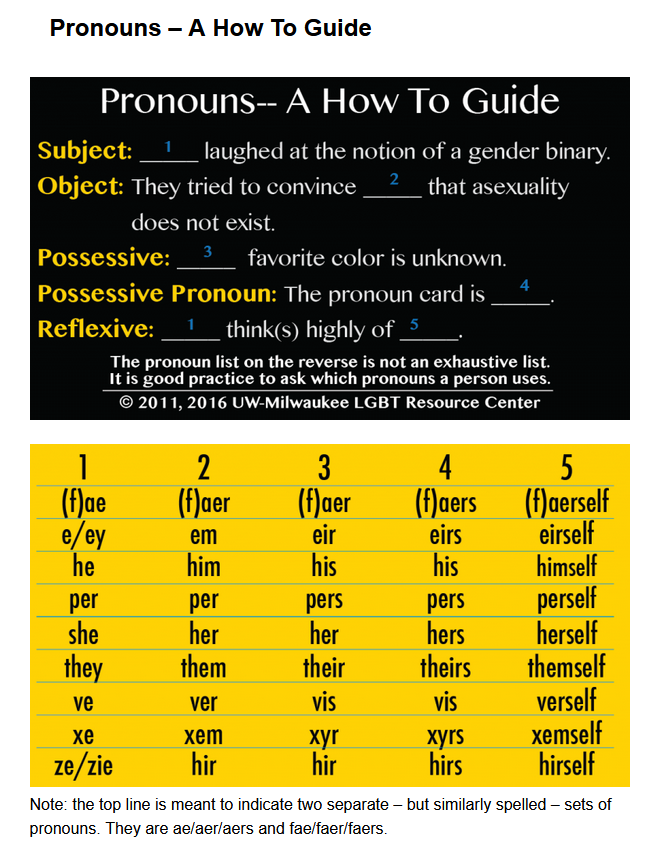

# Advanced Settings

These are game settings that may be configurable in addition the default Ren'Py settings.

## Character Names
Rename each of the characters and their RPG personas to names of the player's choosing.

### Nerdy Character's Name
Text input field, default "Lisa"

### Nerdy Character's RPG Name
Text input field, default "Endaleus"

### Sporty Character's Name
Text input field, default "Christine"

### Sporty Character's RPG Name
Text input field, default "Desiree"

### Perfect Character's Name
Text input field, default "Jane"

### Perfect Character's RPG Name
Text input field, default "Lustrea"

## Character Pronouns

Substitute pronouns of the player's choosing to use for each of the characters and their RPG personas.

### Nerdy Character's Pronouns
Text input field, default "she/her/her/hers/herself"

### Nerdy Character's RPG Pronouns
Text input field, default "they/them/their/theirs/themself"

### Sporty Character's Pronouns
Text input field, default "she/her/her/hers/herself"

### Sporty Character's RPG Pronouns
Text input field, default "she/her/her/hers/herself"

### Perfect Character's Pronouns
Text input field, default "she/her/her/hers/herself"

### Perfect Character's RPG Pronouns
Text input field, default "she/her/her/hers/herself"

## Titles

Change the titles used by each of the characters' RPG personas to a title of the player's choosing.

NOTE: This has no impact on the character's skills or abilities or any other tangible story impact.

### Nerdy Character's RPG Title
Text input field, default "Ancient Hermit"

### Sporty Character's RPG Title
Text input field, default "Fairy Princess"

### Perfect Character's RPG Title
Text input field, default "Rainbow Witch"

## Group Name

Rename the characters' RPG group to a name of the player's choosing.

NOTE: Changing this will change the title of the game as well and will be displayed on the title screen (main menu), but will otherwise have no story impact.

### RPG Group Name
Text input field, default "The Twinkling Trio"

### RPG Group Name Abbreviation
Text input field, default "T3"

## Gameplay

Various options for fine-tuning gameplay, typically to increase or reduce how challenging it is.

### Total Attribute Points
Determines the number of Attribute points each character is allowed to allocate at the beginning of the game.

Text input field, default "30"

### Starting Health
Determines the starting Health value for all characters.

Text input field, default "100"

### Starting Mana
Determines the starting Mana value for all characters.

Text input field, default "100"

### Starting Money
Determines the starting Money value for all characters.

Text input field, default "100"

### Restore Health After Encounter
Determines whether each character's Health is reset to the Starting Health value after each encounter.

On/Off, default On

### Restore Mana After Encounter
Determines whether each character's Mana is reset to the Starting Mana value after each encounter.

On/Off, default On

### Restore Money After Encounter
Determines whether each character's Money is reset to the Starting Money value after each encounter.

On/Off, default Off

### Randomize Strengths and Weaknesses
By default, each character has a designated Strength and Weakness. Turn this option on if you want to randomize each character's Strength and Weakness for each new game to shake up the gameplay.

On/Off, default Off

### Randomize Attribute Allocations
By default, when allocating attributes for each character, choosing "Novice" will allocate 5 points, "Average" will allocate 10 points, and "Expert" will allocate 15 points. Turn this option on to randomize the values within a range (Novice = 0-6, Average = 7-13, Expert = 14-20).

On/Off, default Off

### Automatic Scenario Selection
Determines whether scenarios are automatically selected by the computer (On) or manually selected by the player (Off).

On/Others Only/Off, default Others Only (manually select scenarios when it's the main character's turn, otherwise automatic selection)

### Automatic Action Selection
Determines whether actions are automatically selected by the computer (On) or manually selected by the player (Off).

On/Others Only/Off, default Others Only (manually select actions when it's the main character's turn, otherwise automatic selection)

### Randomization Seed
A specific seed can be used to ensure that particular "random" options are chosen, perhaps to share with someone else. This can impact which scenes and options are shown during encounters as well as any randomization options turned on in Advanced Settings.

Text input field, default is programmatically generated on new game