# Field - Enemies

## Enemy 1
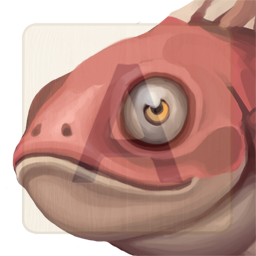

(description goes here)

* Type: Fish
* Health: 75
* Mana: 100
* Attributes
	* Style: 10 (Average)
	* Magic: 10 (Average)
	* Wisdom: 15 (Expert)

### Actions
* Attack
	* Style: 
	* Magic: 
	* Wisdom: 
* Flee
	* Style: 
	* Magic: 
	* Wisdom: 
* Special
	* Style: 
	* Magic: 
	* Wisdom: 

### Rewards
(rewards go here)

## Enemy 2
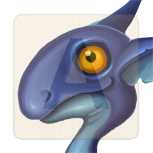

(description goes here)

* Type: Dragon
* Health: 100
* Mana: 100
* Attributes
	* Style: 7 (Average)
	* Magic: 10 (Average)
	* Wisdom: 16 (Expert)

### Actions
* Attack
	* Style: 
	* Magic: 
	* Wisdom: 
* Flee
	* Style: 
	* Magic: 
	* Wisdom: 
* Special
	* Style: 
	* Magic: 
	* Wisdom: 

### Rewards
(rewards go here)

## Enemy 3

(description goes here)

* Type: Reptile
* Health: 75
* Mana: 125
* Attributes
	* Style: 11 (Average)
	* Magic: 16 (Expert)
	* Wisdom: 5 (Novice)

### Actions
* Attack
	* Style: 
	* Magic: 
	* Wisdom: 
* Flee
	* Style: 
	* Magic: 
	* Wisdom: 
* Special
	* Style: 
	* Magic: 
	* Wisdom: 

### Rewards
(rewards go here)

## Enemy 4
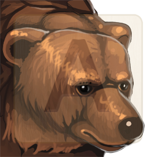

(description goes here)

* Type: Mammal
* Health: 100
* Mana: 100
* Attributes
	* Style: 6 (Novice)
	* Magic: 11 (Average)
	* Wisdom: 9 (Average)

### Actions
* Attack
	* Style: 
	* Magic: 
	* Wisdom: 
* Flee
	* Style: 
	* Magic: 
	* Wisdom: 
* Special
	* Style: 
	* Magic: 
	* Wisdom: 

### Rewards
(rewards go here)

## Enemy 5
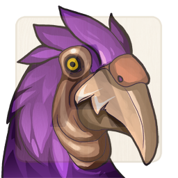

(description goes here)

* Type: Bird
* Health: 100
* Mana: 75
* Attributes
	* Style: 13 (Average)
	* Magic: 4 (Novice)
	* Wisdom: 10 (Average)

### Actions
* Attack
	* Style: 
	* Magic: 
	* Wisdom: 
* Flee
	* Style: 
	* Magic: 
	* Wisdom: 
* Special
	* Style: 
	* Magic: 
	* Wisdom: 

### Rewards
(rewards go here)

## Enemy 7
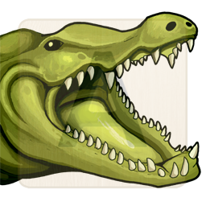

(description goes here)

* Type: Reptile
* Health: 100
* Mana: 125
* Attributes
	* Style: 8 (Average)
	* Magic: 16 (Expert)
	* Wisdom: 10 (Average)

### Actions
* Attack
	* Style: 
	* Magic: 
	* Wisdom: 
* Flee
	* Style: 
	* Magic: 
	* Wisdom: 
* Special
	* Style: 
	* Magic: 
	* Wisdom: 

### Rewards
(rewards go here)

## Enemy 8
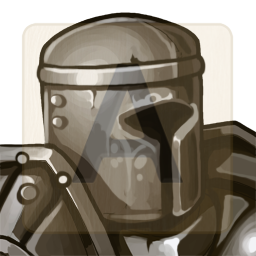

(description goes here)

* Type: Knight
* Health: 125
* Mana: 100
* Attributes
	* Style: 7 (Average)
	* Magic: 11 (Average)
	* Wisdom: 16 (Expert)

### Actions
* Attack
	* Style: 
	* Magic: 
	* Wisdom: 
* Flee
	* Style: 
	* Magic: 
	* Wisdom: 
* Special
	* Style: 
	* Magic: 
	* Wisdom: 

### Rewards
(rewards go here)

## Enemy 13

(description goes here)

* Type: Spirit
* Health: 100
* Mana: 75
* Attributes
	* Style: 11 (Average)
	* Magic: 3 (Novice)
	* Wisdom: 10 (Average)

### Actions
* Attack
	* Style: 
	* Magic: 
	* Wisdom: 
* Flee
	* Style: 
	* Magic: 
	* Wisdom: 
* Special
	* Style: 
	* Magic: 
	* Wisdom: 

### Rewards
(rewards go here)

## Enemy 16
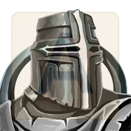

(description goes here)

* Type: Knight
* Health: 125
* Mana: 100
* Attributes
	* Style: 5 (Novice)
	* Magic: 7 (Average)
	* Wisdom: 15 (Expert)

### Actions
* Attack
	* Style: 
	* Magic: 
	* Wisdom: 
* Flee
	* Style: 
	* Magic: 
	* Wisdom: 
* Special
	* Style: 
	* Magic: 
	* Wisdom: 

### Rewards
(rewards go here)

## Enemy 17
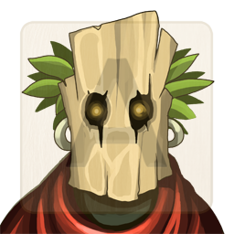

(description goes here)

* Type: Spirit
* Health: 100
* Mana: 100
* Attributes
	* Style: 10 (Average)
	* Magic: 10 (Average)
	* Wisdom: 14 (Expert)

### Actions
* Attack
	* Style: 
	* Magic: 
	* Wisdom: 
* Flee
	* Style: 
	* Magic: 
	* Wisdom: 
* Special
	* Style: 
	* Magic: 
	* Wisdom: 

### Rewards
(rewards go here)

## Enemy 18
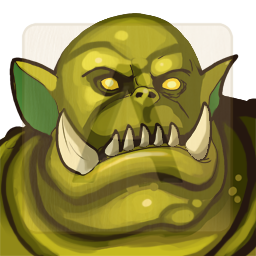

(description goes here)

* Type: Orc
* Health: 125
* Mana: 100
* Attributes
	* Style: 7 (Average)
	* Magic: 10 (Average)
	* Wisdom: 14 (Expert)

### Actions
* Attack
	* Style: 
	* Magic: 
	* Wisdom: 
* Flee
	* Style: 
	* Magic: 
	* Wisdom: 
* Special
	* Style: 
	* Magic: 
	* Wisdom: 

### Rewards
(rewards go here)

## Enemy 22
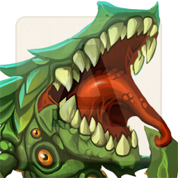

(description goes here)

* Type: Plant
* Health: 100
* Mana: 125
* Attributes
	* Style: 8 (Average)
	* Magic: 15 (Expert)
	* Wisdom: 11 (Average)

### Actions
* Attack
	* Style: 
	* Magic: 
	* Wisdom: 
* Flee
	* Style: 
	* Magic: 
	* Wisdom: 
* Special
	* Style: 
	* Magic: 
	* Wisdom: 

### Rewards
(rewards go here)

## Enemy 23
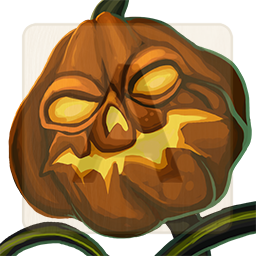

(description goes here)

* Type: Plant
* Health: 100
* Mana: 125
* Attributes
	* Style: 9 (Average)
	* Magic: 14 (Expert)
	* Wisdom: 7 (Average)

### Actions
* Attack
	* Style: 
	* Magic: 
	* Wisdom: 
* Flee
	* Style: 
	* Magic: 
	* Wisdom: 
* Special
	* Style: 
	* Magic: 
	* Wisdom: 

### Rewards
(rewards go here)

## Enemy 24
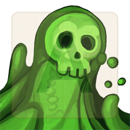

(description goes here)

* Type: Slime
* Health: 100
* Mana: 100
* Attributes
	* Style: 15 (Expert)
	* Magic: 8 (Average)
	* Wisdom: 7 (Average)

### Actions
* Attack
	* Style: 
	* Magic: 
	* Wisdom: 
* Flee
	* Style: 
	* Magic: 
	* Wisdom: 
* Special
	* Style: 
	* Magic: 
	* Wisdom: 

### Rewards
(rewards go here)

------

## Enemy 6
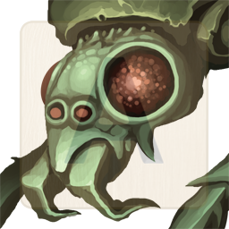

(description goes here)

* Type: Insect
* Health: 100
* Mana: 100
* Attributes
	* Style: 12 (Average)
	* Magic: 11 (Average)
	* Wisdom: 12 (Average)

### Actions
* Attack
	* Style: 
	* Magic: 
	* Wisdom: 
* Flee
	* Style: 
	* Magic: 
	* Wisdom: 
* Special
	* Style: 
	* Magic: 
	* Wisdom: 

### Rewards
(rewards go here)

## Enemy 9
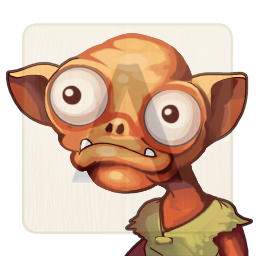

(description goes here)

* Type: Goblin
* Health: 75
* Mana: 100
* Attributes
	* Style: 11 (Average)
	* Magic: 11 (Average)
	* Wisdom: 11 (Average)

### Actions
* Attack
	* Style: 
	* Magic: 
	* Wisdom: 
* Flee
	* Style: 
	* Magic: 
	* Wisdom: 
* Special
	* Style: 
	* Magic: 
	* Wisdom: 

### Rewards
(rewards go here)

## Enemy 10
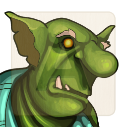

(description goes here)

* Type: Goblin
* Health: 100
* Mana: 100
* Attributes
	* Style: 9 (Average)
	* Magic: 7 (Average)
	* Wisdom: 8 (Average)

### Actions
* Attack
	* Style: 
	* Magic: 
	* Wisdom: 
* Flee
	* Style: 
	* Magic: 
	* Wisdom: 
* Special
	* Style: 
	* Magic: 
	* Wisdom: 

### Rewards
(rewards go here)

## Enemy 11
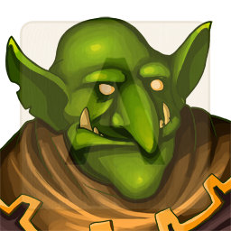

(description goes here)

* Type: Goblin
* Health: 100
* Mana: 100
* Attributes
	* Style: 13 (Average)
	* Magic: 8 (Average)
	* Wisdom: 11 (Average)

### Actions
* Attack
	* Style: 
	* Magic: 
	* Wisdom: 
* Flee
	* Style: 
	* Magic: 
	* Wisdom: 
* Special
	* Style: 
	* Magic: 
	* Wisdom: 

### Rewards
(rewards go here)

## Enemy 12
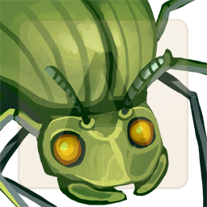

(description goes here)

* Type: Insect
* Health: 100
* Mana: 100
* Attributes
	* Style: 8 (Average)
	* Magic: 13 (Average)
	* Wisdom: 11 (Average)

### Actions
* Attack
	* Style: 
	* Magic: 
	* Wisdom: 
* Flee
	* Style: 
	* Magic: 
	* Wisdom: 
* Special
	* Style: 
	* Magic: 
	* Wisdom: 

### Rewards
(rewards go here)

## Enemy 14

(description goes here)

* Type: Spirit
* Health: 100
* Mana: 100
* Attributes
	* Style: 8 (Average)
	* Magic: 12 (Average)
	* Wisdom: 12 (Average)

### Actions
* Attack
	* Style: 
	* Magic: 
	* Wisdom: 
* Flee
	* Style: 
	* Magic: 
	* Wisdom: 
* Special
	* Style: 
	* Magic: 
	* Wisdom: 

### Rewards
(rewards go here)

## Enemy 15

(description goes here)

* Type: Slime
* Health: 100
* Mana: 100
* Attributes
	* Style: 11 (Average)
	* Magic: 10 (Average)
	* Wisdom: 12 (Average)

### Actions
* Attack
	* Style: 
	* Magic: 
	* Wisdom: 
* Flee
	* Style: 
	* Magic: 
	* Wisdom: 
* Special
	* Style: 
	* Magic: 
	* Wisdom: 

### Rewards
(rewards go here)

## Enemy 19
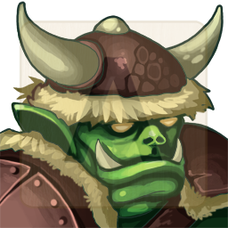

(description goes here)

* Type: Orc
* Health: 100
* Mana: 100
* Attributes
	* Style: 12 (Average)
	* Magic: 10 (Average)
	* Wisdom: 12 (Average)

### Actions
* Attack
	* Style: 
	* Magic: 
	* Wisdom: 
* Flee
	* Style: 
	* Magic: 
	* Wisdom: 
* Special
	* Style: 
	* Magic: 
	* Wisdom: 

### Rewards
(rewards go here)

## Enemy 20
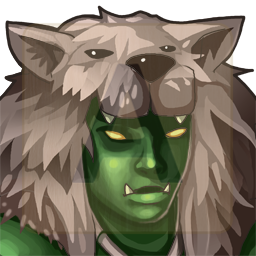

(description goes here)

* Type: Orc
* Health: 100
* Mana: 100
* Attributes
	* Style: 11 (Average)
	* Magic: 8 (Average)
	* Wisdom: 9 (Average)

### Actions
* Attack
	* Style: 
	* Magic: 
	* Wisdom: 
* Flee
	* Style: 
	* Magic: 
	* Wisdom: 
* Special
	* Style: 
	* Magic: 
	* Wisdom: 

### Rewards
(rewards go here)

## Enemy 21
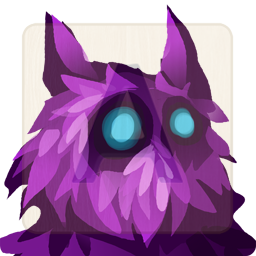

(description goes here)

* Type: Spirit
* Health: 100
* Mana: 100
* Attributes
	* Style: 11 (Average)
	* Magic: 13 (Average)
	* Wisdom: 9 (Average)

### Actions
* Attack
	* Style: 
	* Magic: 
	* Wisdom: 
* Flee
	* Style: 
	* Magic: 
	* Wisdom: 
* Special
	* Style: 
	* Magic: 
	* Wisdom: 

### Rewards
(rewards go here)
