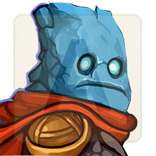
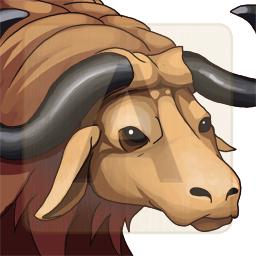
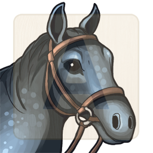

# Snow - NPCs

## NPC 1

(description goes here)

* Type: Unique
* Health: 100
* Mana: 100
* Attributes
	* Style: 16 (Expert)
	* Magic: 10 (Average)
	* Wisdom: 8 (Average)

### Actions
* Special
	* Style: 
	* Magic: 
	* Wisdom: 

## NPC 2

(description goes here)

* Type: Bard
* Health: 100
* Mana: 100
* Attributes
	* Style: 7 (Average)
	* Magic: 8 (Average)
	* Wisdom: 9 (Average)

### Actions
* Special
	* Style: 
	* Magic: 
	* Wisdom: 

## NPC 3

(description goes here)

* Type: Quest Giver
* Health: 100
* Mana: 100
* Attributes
	* Style: 7 (Average)
	* Magic: 12 (Average)
	* Wisdom: 11 (Average)

### Actions
* Special
	* Style: 
	* Magic: 
	* Wisdom: 

## NPC 4

(description goes here)

* Type: Merchant
* Health: 100
* Mana: 100
* Attributes
	* Style: 14 (Expert)
	* Magic: 12 (Average)
	* Wisdom: 9 (Average)

### Actions
* Special
	* Style: 
	* Magic: 
	* Wisdom: 

## NPC 5

(description goes here)

* Type: Priest
* Health: 100
* Mana: 100
* Attributes
	* Style: 10 (Average)
	* Magic: 14 (Expert)
	* Wisdom: 15 (Expert)

### Actions
* Special
	* Style: 
	* Magic: 
	* Wisdom: 
