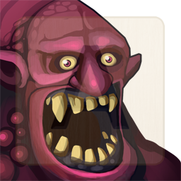

# Volcano - Enemies

## Enemy 1

(description goes here)

* Type: Undead
* Health: 100
* Mana: 125
* Attributes
	* Style: 12 (Average)
	* Magic: 14 (Expert)
	* Wisdom: 9 (Average)

### Actions
* Attack
	* Style: 
	* Magic: 
	* Wisdom: 
* Flee
	* Style: 
	* Magic: 
	* Wisdom: 
* Special
	* Style: 
	* Magic: 
	* Wisdom: 

### Rewards
(rewards go here)

## Enemy 2

(description goes here)

* Type: Knight
* Health: 100
* Mana: 125
* Attributes
	* Style: 11 (Average)
	* Magic: 15 (Expert)
	* Wisdom: 11 (Average)

### Actions
* Attack
	* Style: 
	* Magic: 
	* Wisdom: 
* Flee
	* Style: 
	* Magic: 
	* Wisdom: 
* Special
	* Style: 
	* Magic: 
	* Wisdom: 

### Rewards
(rewards go here)

## Enemy 3

(description goes here)

* Type: Demon
* Health: 100
* Mana: 100
* Attributes
	* Style: 12 (Average)
	* Magic: 9 (Average)
	* Wisdom: 14 (Expert)

### Actions
* Attack
	* Style: 
	* Magic: 
	* Wisdom: 
* Flee
	* Style: 
	* Magic: 
	* Wisdom: 
* Special
	* Style: 
	* Magic: 
	* Wisdom: 

### Rewards
(rewards go here)

## Enemy 4

(description goes here)

* Type: Demon
* Health: 100
* Mana: 125
* Attributes
	* Style: 6 (Novice)
	* Magic: 15 (Expert)
	* Wisdom: 10 (Average)

### Actions
* Attack
	* Style: 
	* Magic: 
	* Wisdom: 
* Flee
	* Style: 
	* Magic: 
	* Wisdom: 
* Special
	* Style: 
	* Magic: 
	* Wisdom: 

### Rewards
(rewards go here)

## Enemy 7

(description goes here)

* Type: Demon
* Health: 100
* Mana: 125
* Attributes
	* Style: 12 (Average)
	* Magic: 14 (Expert)
	* Wisdom: 11 (Average)

### Actions
* Attack
	* Style: 
	* Magic: 
	* Wisdom: 
* Flee
	* Style: 
	* Magic: 
	* Wisdom: 
* Special
	* Style: 
	* Magic: 
	* Wisdom: 

### Rewards
(rewards go here)

## Enemy 11

(description goes here)

* Type: Golem
* Health: 125
* Mana: 100
* Attributes
	* Style: 6 (Novice)
	* Magic: 8 (Average)
	* Wisdom: 6 (Novice)

### Actions
* Attack
	* Style: 
	* Magic: 
	* Wisdom: 
* Flee
	* Style: 
	* Magic: 
	* Wisdom: 
* Special
	* Style: 
	* Magic: 
	* Wisdom: 

### Rewards
(rewards go here)

## Enemy 13

(description goes here)

* Type: Knight
* Health: 100
* Mana: 125
* Attributes
	* Style: 11 (Average)
	* Magic: 15 (Expert)
	* Wisdom: 13 (Average)

### Actions
* Attack
	* Style: 
	* Magic: 
	* Wisdom: 
* Flee
	* Style: 
	* Magic: 
	* Wisdom: 
* Special
	* Style: 
	* Magic: 
	* Wisdom: 

### Rewards
(rewards go here)

## Enemy 14

(description goes here)

* Type: Knight
* Health: 125
* Mana: 100
* Attributes
	* Style: 14 (Expert)
	* Magic: 13 (Average)
	* Wisdom: 5 (Novice)

### Actions
* Attack
	* Style: 
	* Magic: 
	* Wisdom: 
* Flee
	* Style: 
	* Magic: 
	* Wisdom: 
* Special
	* Style: 
	* Magic: 
	* Wisdom: 

### Rewards
(rewards go here)

## Enemy 15

(description goes here)

* Type: Orc
* Health: 100
* Mana: 100
* Attributes
	* Style: 11 (Average)
	* Magic: 8 (Average)
	* Wisdom: 15 (Expert)

### Actions
* Attack
	* Style: 
	* Magic: 
	* Wisdom: 
* Flee
	* Style: 
	* Magic: 
	* Wisdom: 
* Special
	* Style: 
	* Magic: 
	* Wisdom: 

### Rewards
(rewards go here)

## Enemy 17

(description goes here)

* Type: Bird
* Health: 100
* Mana: 125
* Attributes
	* Style: 12 (Average)
	* Magic: 16 (Expert)
	* Wisdom: 9 (Average)

### Actions
* Attack
	* Style: 
	* Magic: 
	* Wisdom: 
* Flee
	* Style: 
	* Magic: 
	* Wisdom: 
* Special
	* Style: 
	* Magic: 
	* Wisdom: 

### Rewards
(rewards go here)

## Enemy 19

(description goes here)

* Type: Insect
* Health: 100
* Mana: 125
* Attributes
	* Style: 9 (Average)
	* Magic: 17 (Expert)
	* Wisdom: 13 (Average)

### Actions
* Attack
	* Style: 
	* Magic: 
	* Wisdom: 
* Flee
	* Style: 
	* Magic: 
	* Wisdom: 
* Special
	* Style: 
	* Magic: 
	* Wisdom: 

### Rewards
(rewards go here)

------

## Enemy 5

(description goes here)

* Type: Demon
* Health: 75
* Mana: 100
* Attributes
	* Style: 7 (Average)
	* Magic: 13 (Average)
	* Wisdom: 13 (Average)

### Actions
* Attack
	* Style: 
	* Magic: 
	* Wisdom: 
* Flee
	* Style: 
	* Magic: 
	* Wisdom: 
* Special
	* Style: 
	* Magic: 
	* Wisdom: 

### Rewards
(rewards go here)

## Enemy 6

(description goes here)

* Type: Demon
* Health: 125
* Mana: 100
* Attributes
	* Style: 8 (Average)
	* Magic: 11 (Average)
	* Wisdom: 13 (Average)

### Actions
* Attack
	* Style: 
	* Magic: 
	* Wisdom: 
* Flee
	* Style: 
	* Magic: 
	* Wisdom: 
* Special
	* Style: 
	* Magic: 
	* Wisdom: 

### Rewards
(rewards go here)

## Enemy 8

(description goes here)

* Type: Dragon
* Health: 100
* Mana: 100
* Attributes
	* Style: 10 (Average)
	* Magic: 11 (Average)
	* Wisdom: 11 (Average)

### Actions
* Attack
	* Style: 
	* Magic: 
	* Wisdom: 
* Flee
	* Style: 
	* Magic: 
	* Wisdom: 
* Special
	* Style: 
	* Magic: 
	* Wisdom: 

### Rewards
(rewards go here)

## Enemy 9

(description goes here)

* Type: Dragon
* Health: 75
* Mana: 100
* Attributes
	* Style: 11 (Average)
	* Magic: 10 (Average)
	* Wisdom: 9 (Average)

### Actions
* Attack
	* Style: 
	* Magic: 
	* Wisdom: 
* Flee
	* Style: 
	* Magic: 
	* Wisdom: 
* Special
	* Style: 
	* Magic: 
	* Wisdom: 

### Rewards
(rewards go here)

## Enemy 10

(description goes here)

* Type: Demon
* Health: 75
* Mana: 100
* Attributes
	* Style: 9 (Average)
	* Magic: 13 (Average)
	* Wisdom: 12 (Average)

### Actions
* Attack
	* Style: 
	* Magic: 
	* Wisdom: 
* Flee
	* Style: 
	* Magic: 
	* Wisdom: 
* Special
	* Style: 
	* Magic: 
	* Wisdom: 

### Rewards
(rewards go here)

## Enemy 12

(description goes here)

* Type: Golem
* Health: 100
* Mana: 100
* Attributes
	* Style: 8 (Average)
	* Magic: 10 (Average)
	* Wisdom: 8 (Average)

### Actions
* Attack
	* Style: 
	* Magic: 
	* Wisdom: 
* Flee
	* Style: 
	* Magic: 
	* Wisdom: 
* Special
	* Style: 
	* Magic: 
	* Wisdom: 

### Rewards
(rewards go here)

## Enemy 16

(description goes here)

* Type: Orc
* Health: 125
* Mana: 100
* Attributes
	* Style: 7 (Average)
	* Magic: 11 (Average)
	* Wisdom: 11 (Average)

### Actions
* Attack
	* Style: 
	* Magic: 
	* Wisdom: 
* Flee
	* Style: 
	* Magic: 
	* Wisdom: 
* Special
	* Style: 
	* Magic: 
	* Wisdom: 

### Rewards
(rewards go here)

## Enemy 18

(description goes here)

* Type: Golem
* Health: 125
* Mana: 100
* Attributes
	* Style: 10 (Average)
	* Magic: 12 (Average)
	* Wisdom: 12 (Average)

### Actions
* Attack
	* Style: 
	* Magic: 
	* Wisdom: 
* Flee
	* Style: 
	* Magic: 
	* Wisdom: 
* Special
	* Style: 
	* Magic: 
	* Wisdom: 

### Rewards
(rewards go here)
