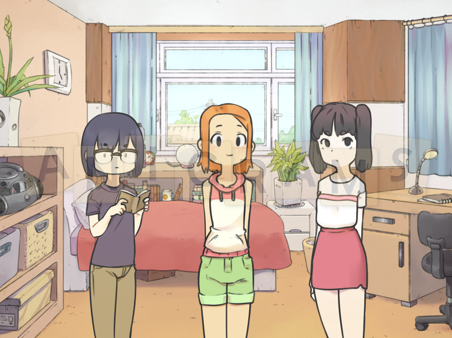

# SuNoFes Game Jam 2021

[SuNoFes 2021](https://itch.io/jam/sunofes21) runs on itch.io from July 1st 2021 at 5:00 AM to September 3rd 2021 at 3:00 PM. The project must be a visual novel or story-focused game.

## The Twinkling Trio (T3)

A simple game about how fun it can be to create stories with friends.

Play as a nerdy middle-school dungeon master trying to teach her excitable (and notably "normie") friends how to play a tabletop RPG.

The game is split into 5 themed encounters, each consisting of 5-7 randomized segments where the player must select a "card" to determine which dangerous situation to throw the party into next.

## To-Do
Plan out the game (Deadline: 8/7/2021)
- [ ] Design or decide on a tabletop RPG system to use
- [x] Flesh out characters, personalities, and quirks
- [x] Determine overall story (if there is one)
- [ ] Determine story and "cards" available for each encounter

Write scripts (Deadline: 8/18/2021)
- [ ] Encounter 1
- [ ] Encounter 2
- [ ] Encounter 3
- [ ] Encounter 4
- [ ] Encounter 5

Design and customize interface (Deadline: 9/3/2021)
- [ ] Main menu
- [ ] Game within the game
- [ ] Dice rolling
- [ ] Select music tracks
- [ ] Text box
- [ ] Choices
- [ ] Options menu
- [ ] Save/Load menu
- [ ] Favicon
